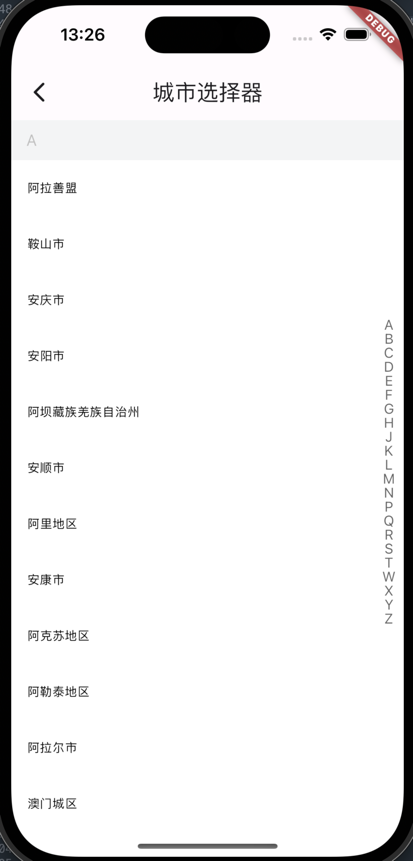

# hook_up_rent

好客租房项目实战

解析JSON需要的依赖：
dependencies:
    flutter:
        #json序列化工具
        json_annotation: ^4.9.0
        build_runner: ^2.4.9

dev_dependencies:
    build_runner: ^2.3.3
    json_serializable: ^6.8.0

执行命令：
    dart run build_runner build ， 生成解析JSON的代码

## 实现的功能/页面
 - 登录页
 - 注册页
 - 首页
   - 首页tab
   - 搜索tab
   - 咨询tab
   - 我的tab
 - 搜索页
 - 房屋管理
 - 添加房屋
 - 房屋详情
 - 设置
## 项目知识点
* 使用第三方组件
* 通用组件封装
* 使用静态资源
  * 本地图片
  * 网络图片
  * 使用自带icon
  * 使用字体icon
  * 网络图片缓存超时处理
* 本地存储及store封装
* 数据管理scoped_model
* 网络请求及dio_http封装
* 序列化及反序列化半自动生成实体类
* 图片上传
* app icon 及启动页

## 项目截图：
   
   
   
   
 

